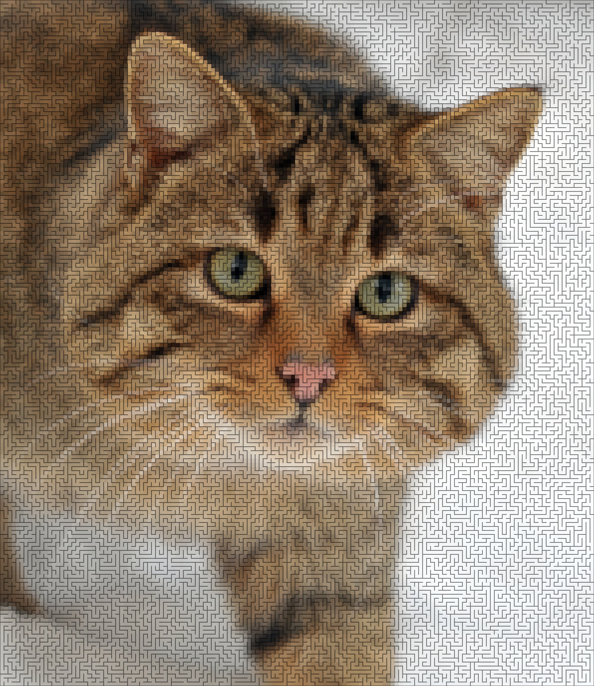
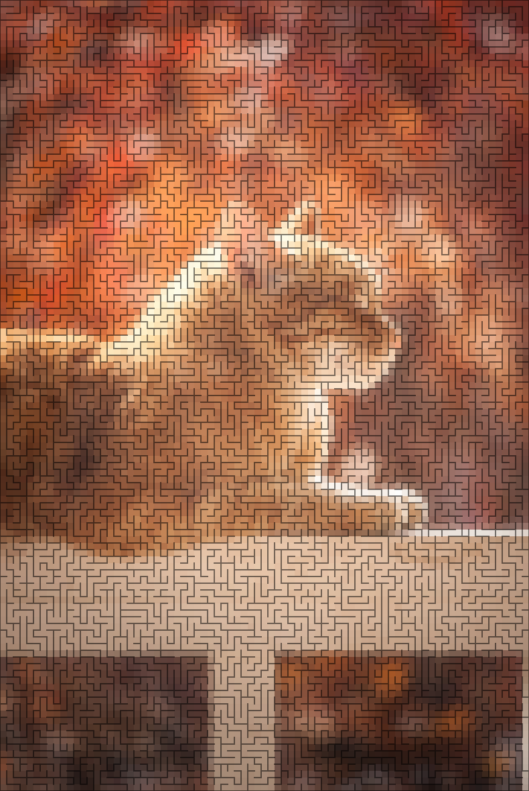

# Depth-First Search Image Filter
Apply depth-first search inspired image filters to images.

# Example usage

The [run.py](dfsif/run.py) script contains a sample usage case for the depth-first search image filter.

Example usage:
```shell script
python run.py cat_original.jpg --cell-size 10
```

Using a Wikimedia Commons [cat picture](https://commons.wikimedia.org/wiki/File:Felis_silvestris_silvestris.jpg)
([Copyright Michael Gäbler](https://commons.wikimedia.org/wiki/User:Michael_Gäbler)):



Or using a
[cat photo by Bekka Mongeau from Pexels](https://www.pexels.com/photo/tabby-cat-on-white-wooden-fence-804475/):


